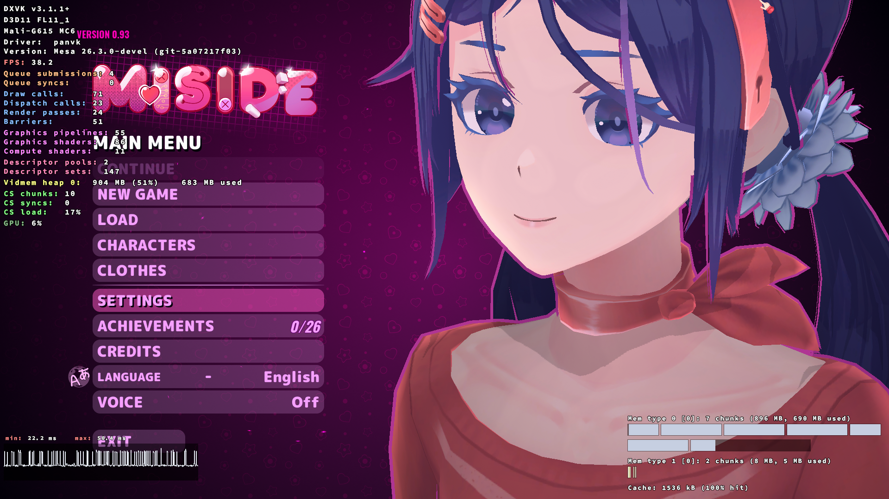
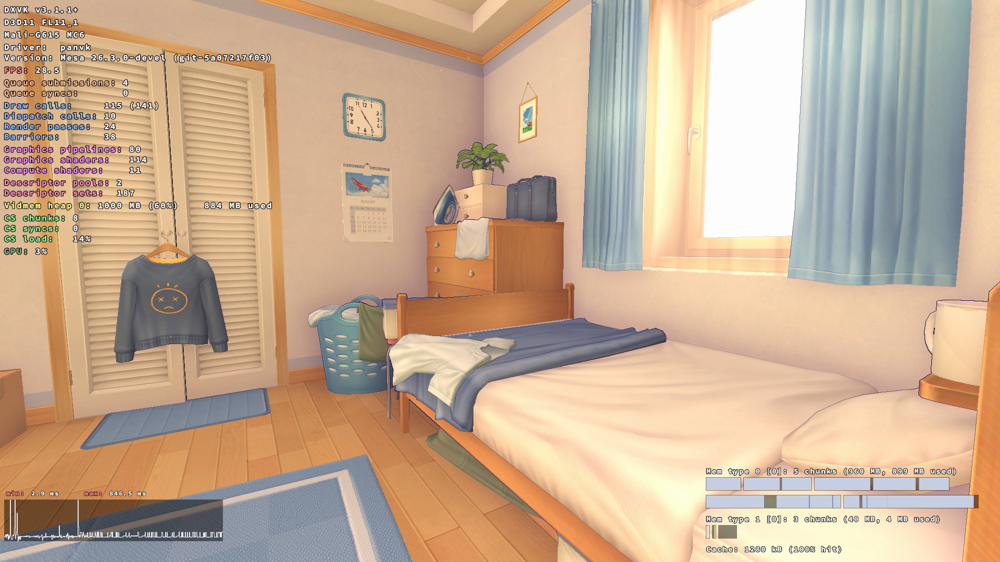
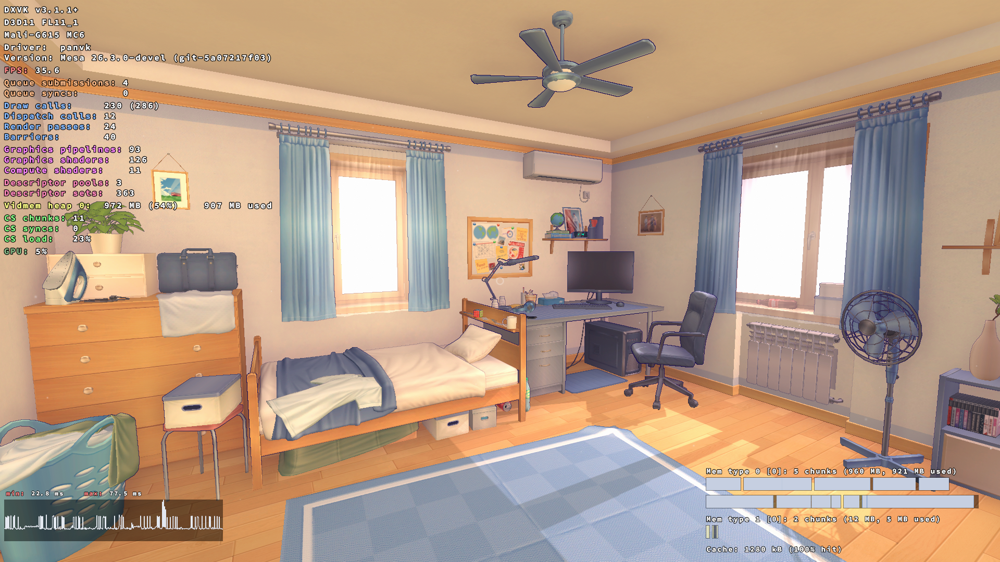
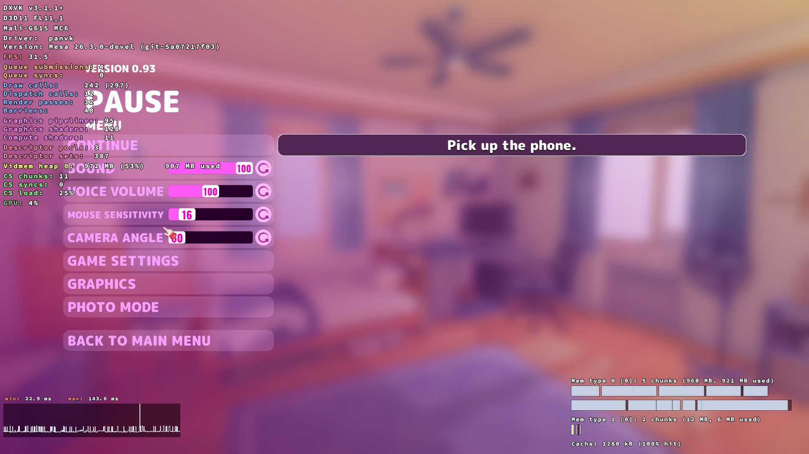
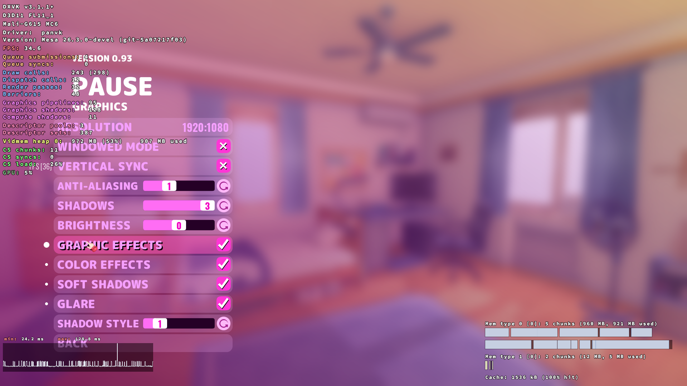

# MiSide on PanVK (Mali-G615 MC6) via the launcher

Game: MiSide (`MiSideFull.exe`), x86_64 PE, Unity 2021.3.35f1 IL2CPP, Direct3D 11 (FL11_1 under DXVK 3.1.1).
Stack: Proton 11.0-2-arm64ec Wine + FEX, DXVK 3.1.1, PanVK ICD (Mesa 26.3.0-devel git-5a07217f03, labelled beta.8, sha 4430...).
All iterations so far used that ICD. No driver changes yet.

## Screenshots (full 1920x1080 game window, DXVK HUD visible)

| File | Caption |
|---|---|
|  | Main menu. Launcher run, x86_64 via FEX, beta.8 ICD, 38.2 FPS. |
|  | Gameplay. Launcher run, x86_64 via FEX, beta.8 ICD, 28.5 FPS. |
|  | Gameplay. Harness run (same env as launcher), beta.8 ICD, 35.6 FPS. |
|  | Pause menu. Harness run, beta.8 ICD, 31.5 FPS. |
|  | Graphics settings (1920:1080, shadows 3). Harness run, beta.8 ICD, 34.6 FPS. |

## How it was copied and launched

- `adb push` game dir to `/sdcard/Games/MiSide`.
- Launcher, Wine tab, "Run Executable by Path" = `/sdcard/Games/MiSide/MiSideFull.exe`, Run.
- Logs: `files/logs/run-*.log`; Unity log at `files/container/.wine/drive_c/users/xuser/AppData/LocalLow/AIHASTO/MiSideFull/Player.log`.

## Iteration log

| Iter | Change | Result |
|---|---|---|
| 00 | Baseline launcher UI | launcher.png only |
| 01 | First launch via path field | Hang after `steam_api64` load; launcher cgroup frozen when Termux:X11 foregrounds |
| 02 | Unfreeze loop (root) | Still hang |
| 03 | `WINEDEBUG=+loaddll` | Hang is in `SteamAPI_Init` (Goldberg gbe_fork) |
| 04 | Goldberg `configs.main.ini`: `disable_networking=1`, `offline=1`. Harness run | Menu and gameplay clean, ~35 FPS |
| 05 | Same via launcher UI | Works, 9.5 FPS (Wine threads pinned to little cores by Android background cpuset) |
| 06 | Threads moved to top-app cpuset/cpuctl (root) | 28-38 FPS. Later `VK_ERROR_DEVICE_LOST` after Esc then Graphics: kbase tiler heap OoM, `Invalid Heap statistics` |
| 07 | Re-run on new APK | Killed by shortcut-agent APK install |

## Findings

1. Launcher/Android (not driver): when Termux:X11 takes the foreground, Android freezes the launcher cgroup or moves it to the background cpuset. Wine stalls or runs at about 9 FPS. Fix: foreground service while Wine runs, or an in-app X server activity (builtin X server).
2. Game config: the bundled Goldberg `steam_api64.dll` hangs in `SteamAPI_Init` under Wine with networking on. Fix applied to the device copy only (`steam_settings/configs.main.ini`).
3. Driver, open: intermittent `VK_ERROR_DEVICE_LOST`. kbase `kbase_queue_oom_event` sees `frag_end > vt_end || vt_end >= vt_start`, flags invalid heap statistics, terminates the group. Seen once (iter06 dmesg in `iter06/dmesg-mali.txt`, `dmesg-devicelost.txt`). Not reproduced in iter04. Candidate areas: patch `csf-v11/043` heap renewal, `cs_heap_set` per draw, tiler heap sizing.
