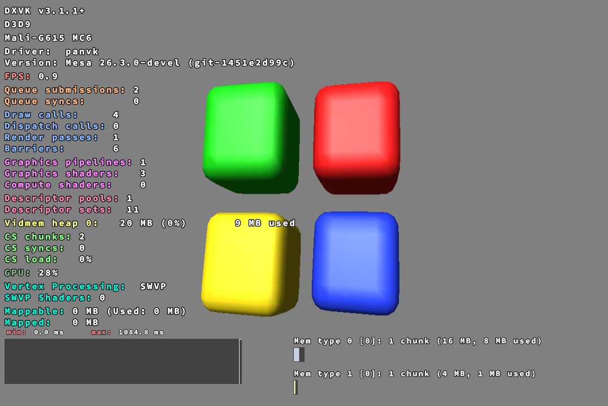
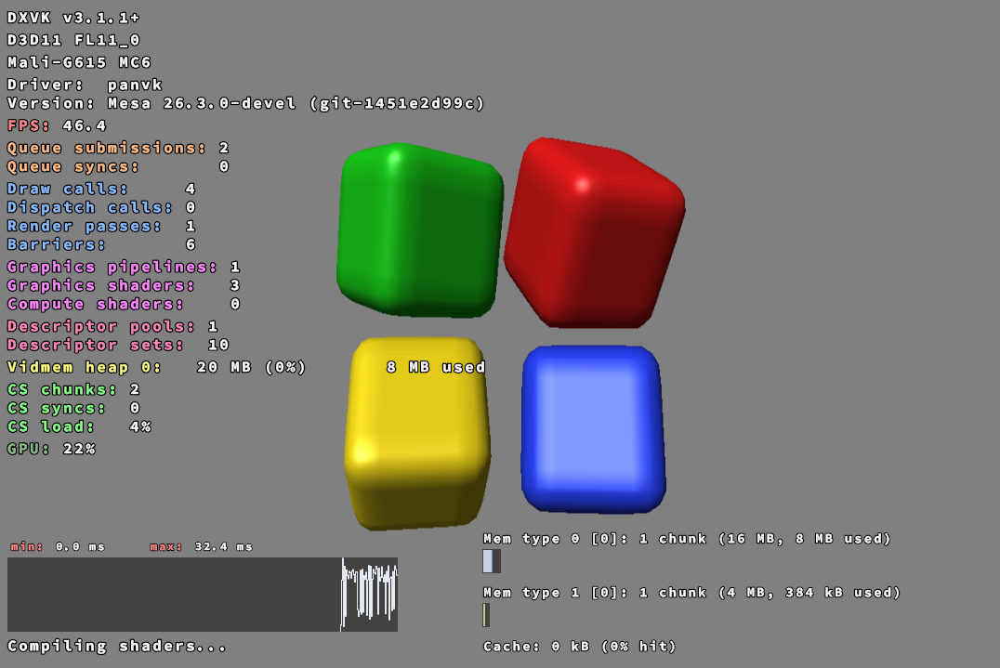
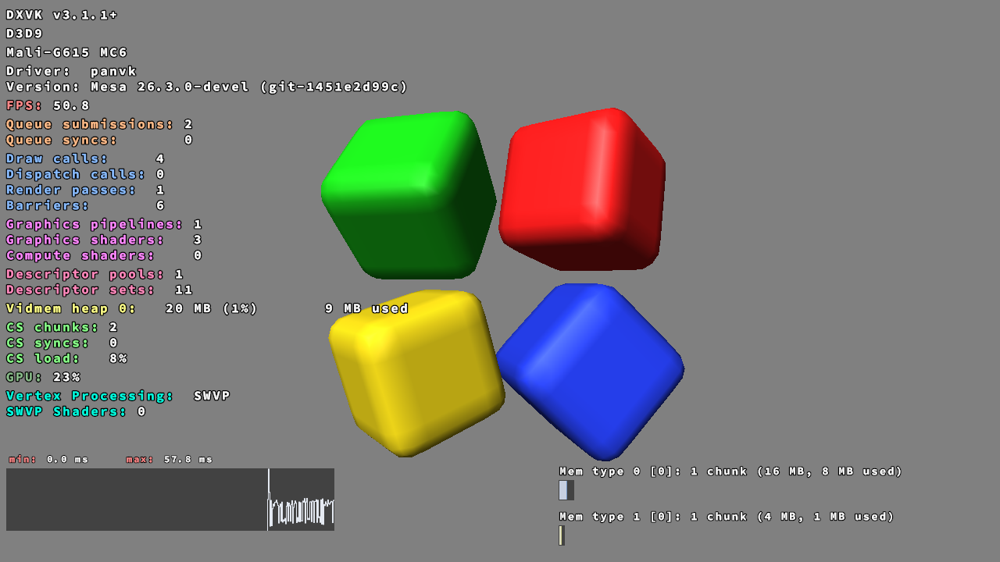
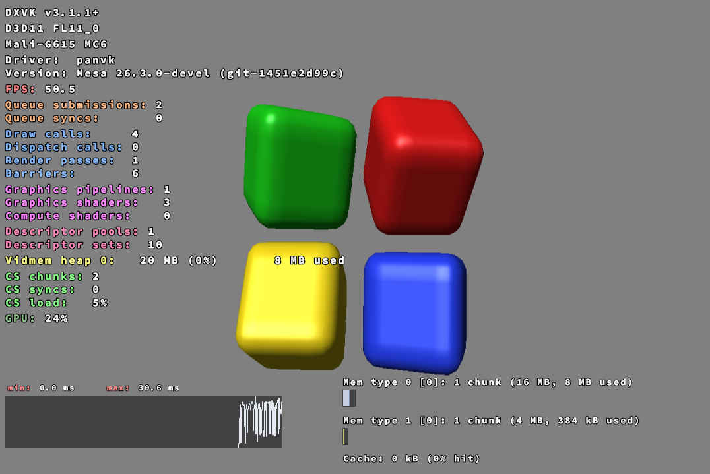
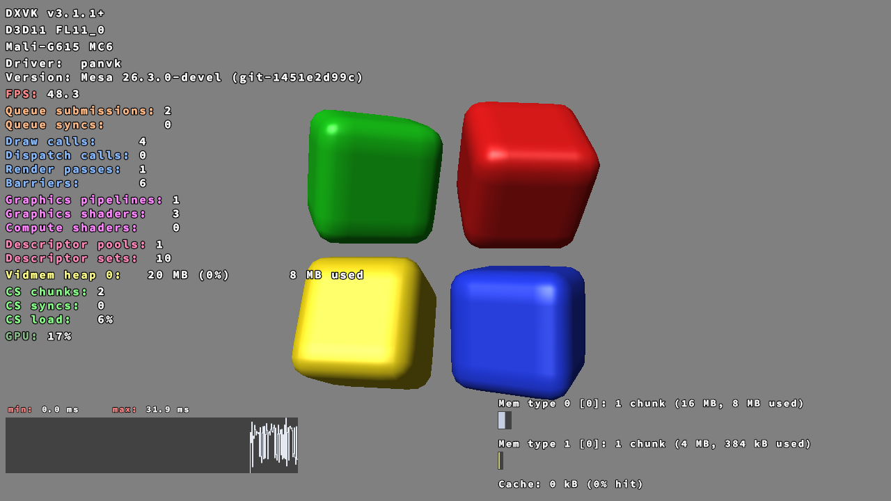

# i686 WOW64 placed vkMapMemory (2026-10-03)

Device 192.168.1.34:40501, launcher APK container, ICD `files/m4wsi/libvulkan_panfrost.so` (dxenv-synchronized.sh), `draw-test/run.py` + `analyze.py`, XGetImage readback.

Driver: mesa tree `/var/tmp/panvk/mesa-sameva` (copy of work/mesa-viewport-runs-fixed with the unreviewed vp-runs WIP reverted) + `patches/kbase-common/.../kbase_kmod.c`. Build: `scripts/build-android.sh`, `/var/tmp/panvk/dist-sameva/libvulkan_panfrost.so`.

## Finding 1: mremap is refused

First implementation (mremap SAME_VA VMA to the placed address) fails on G615 kbase:
`MESA: error: kbase: mremap to caller-chosen address 0x1890000 failed: Invalid argument` -> `vkMapMemory2EXT failed: -5` -> DXVK abort (d3d9) / `E_FAIL` (d3d11). kbase get_unmapped_area rejects MAP_FIXED, so mremap(MREMAP_FIXED) is refused too.

## Fix: shadow copy

`bo_mmap(host_addr)` now mmaps an anonymous MAP_FIXED shadow at the requested address (copy of the BO). `kbase_shadow_merge()` reconciles per 8-byte word (shadow vs BO vs last snapshot) before every `CS_QUEUE_KICK`, after every CSF wait, on flush ranges (push) and invalidate (pull), and on unmap. Ceiling: O(placed bytes) per kick/wait; replace with dirty tracking for large placed maps.

## Results (final driver)

| run | result |
| --- | --- |
| i686 d3d11 | create ok FL 0xb000, 8 Presents, PASS, no MESA error; XGetImage: bg 39936 px, tri (58,44,153), quad (255,255,0) |
| i686 d3d9 | CreateDevice ok, 8 Presents, PASS; bg 37865 px, tri (69,33,153), quad (255,255,0) |
| arm64ec d3d11 / d3d9 | PASS, pixels identical to i686 (regression ok) |
| x86_64 (FEX) d3d11 / d3d9 | PASS, pixels identical (regression ok) |

Before (mremap build): i686 d3d11 `E_FAIL`/CreateBuffer path dead, d3d9 process aborted. Black frames.

Not run: CTS api.memory_map (placed maps are not used by CTS; the non-placed path is unchanged and covered by the 64-bit draw runs). Real 32-bit game not run. Coherency under heavy use (large placed maps, GPU->CPU readback without a wait/invalidate) is unproven.

Device state: `m4wsi/libvulkan_panfrost.so` = new build; original saved as `m4wsi/libvulkan_panfrost.so.orig-before-sameva` (md5 97937f6a...). `drivers/PanVK_Kbase_G615/` restored to original.

## Cube demo ("Test Direct3D", 2026-10-03)

`tests/dxcube.c`: 2x2 lit rounded blocks (green/red/yellow/blue) on grey, indexed VB+IB with normals, D24S8 depth, continuous rotation, window title "Test Direct3D", 1280x720 (`DXCUBE_W`/`DXCUBE_H`); d3d9 fixed function, d3d11 HLSL. Run with `tests/dxcube-run.py <d3d9|d3d11> <outdir> DXVK_HUD=full` (dxenv + XGetImage harness). Each `cube-*` dir: screenshot.png (adb screencap), dc.ppm-*.png (XGetImage of each X window), run.log, stderr.log. All runs use `DXVK_HUD=full`; full HUD visible in every screenshot (DXVK version, API/FL, device, driver, Mesa version, FPS, queue/draw/pipeline/descriptor counters, vidmem, CS, GPU load, frametime graph, memory chunks).

| run | frames in 25 s | screenshot |
| --- | --- | --- |
| i686 d3d9 | 23 (FPS 0.9) | shaded rounded blocks, correct colors/depth, HUD complete |
| i686 d3d11 | 1227 (~48 fps) | same |
| x86_64 d3d11 | 1193 (FPS 50) | same (regression ok) |
| x86_64 d3d9 | 1050 | same |
| arm64ec d3d11 | 1188 | PASS |

No MESA/VK errors in any stderr.log.

Open issue: i686 d3d9 renders correctly but at ~1 fps (HUD max frametime ~1084 ms, every frame); i686 d3d11 and all 64-bit runs are ~40-50 fps with the same 4 draws. A fixed ~1 s per frame smells like a wait/timeout (possibly the kbase shadow merge path or a DXVK d3d9 managed-buffer map pattern on placed maps). Not investigated yet.

Launcher: `Containers.env()` now defaults `DXVK_HUD=full` when DXVK is enabled (user-set DXVK_HUD in `extra` or app env wins). APK rebuilt and installed with `install -r`; HUD output verified through the dxenv harness with `DXVK_HUD=full`, not by launching a game from the launcher UI.

Screenshots (adb screencap cropped to the game window, `DXVK_HUD=full`):

i686 (WOW64) D3D9, FPS 0.9 (open issue above).

i686 (WOW64) D3D11, FPS 46.4.

x86_64 (FEX) D3D9, FPS 50.8.

x86_64 (FEX) D3D11, FPS 50.5.

ARM64EC D3D11, FPS 48.3.
